# SMS Gateway - Coding Challenge 2

## Team Members

- Susan Henriquez and Anh Le

## How to Run

**Prerequisites:** Java 25 (Temurin or equivalent). No external services required — all storage is in-memory.

From the project root:

```bash
./gradlew bootRun
```

The application listens on **http://localhost:8080**.

To run the test suite:

```bash
./gradlew test
```

For a full end-to-end walkthrough of the happy path and negative cases, see [doc/e2e-sms-developer-guide.md](doc/e2e-sms-developer-guide.md).

## Approach

An SMS gateway that accepts message send requests, resolves the carrier from the phone number prefix, applies routing rules to select a provider, and tracks the full message lifecycle through provider callbacks. All state is persisted as an append-only event log; reports are produced by replaying that log.

**API endpoints:**

| Endpoint | Description |
|---|---|
| `POST /api/v1/sendSms` | Submit an SMS for routing and dispatch |
| `GET /api/v1/callback-simulation` | Simulate a provider callback (Queue, Send-to-carrier, Send-success, Carrier-rejected) |
| `GET /api/v1/costPerCountry` | Estimated and actual cost aggregated by country |
| `GET /api/v1/costPerProvider` | Estimated and actual cost aggregated by provider |
| `GET /api/v1/smsVolumePerProvider` | Message count per provider |
| `GET /api/v1/deliveryRatePerProvider` | Success/failure rates per provider |

## Design Decisions

- **Event Sourcing** — messages are stored as an immutable sequence of domain events (`NewMessageRequestReceived`, `RoutePlanCalculated`, `SentToProvider`, `Queued`, `SuccessfullySentToCarrier`, `SentSuccessfully`, `CarrierRejected`). State is always derived by replaying the event store; there is no mutable row to update and no risk of lost updates. 

- **CQRS** — write side processes commands (`SendSms`) and emits events; read side has dedicated projectors (`MessageCostViewProjector`, `MessageVolumeViewProjector`, `MessageDeliveryViewProjector`) that fold the event stream into query-specific views on demand.

- **Chain of Responsibility** — provider callbacks are dispatched through a chain of `ExternalEventHandler` implementations. Each handler declares which external event type it handles; the dispatcher walks the chain and delegates to the first match.

- **Strategy pattern for routing** — `RouteToProviderCalculator` accepts a pluggable routing strategy (`CheapestProviderRouting`, `AIProviderRouting`), making it straightforward to swap or A/B-test routing algorithms without touching the core domain.

- **In-memory repositories** — `InmemoryEventRepository`, `InmemoryMessageRepository`, and `InmemoryAgreementRepository` keep the solution self-contained and remove any infrastructure setup from the evaluation path.

For details check [doc/architecture/decisions](doc/architecture/decisions)


## Architecture Diagram

```mermaid
classDiagram
    direction TB

    %% ── REST / Listener layer (Adapter) ─────────────────────
    class PostSMS {
        <<Adapter>>
        +sendSms()
    }
    class CallbackSimulation {
        <<Adapter>>
        +callback()
    }
    class GetCostPerCountry {
        <<Adapter>>
        +getCostPerCountry()
    }
    class GetCostPerProvider {
        <<Adapter>>
        +getCostPerProvider()
    }
    class GetSMSVolumePerProvider {
        <<Adapter>>
        +getSMSVolumePerProvider()
    }
    class GetDeliveryRatePerProvider {
        <<Adapter>>
        +getDeliveryRatePerProvider()
    }

    %% ── Application layer ────────────────────────────────────
    class SendSmsHandler {
        +handle(SendSms)
    }
    class ExternalEventHandlerDispatcher {
        <<Service Locator>>
        +dispatch(ExternalEvent)
    }
    class ProviderMessageDispatcher {
        <<Service Locator>>
        +dispatch(message, provider)
    }

    %% ── Strategy pattern ─────────────────────────────────────
    class RouteToProviderCalculator {
        <<Strategy interface>>
        +calculate(agreements, carrier) RoutePlan
    }
    class CheapestProviderRouting {
        <<Strategy>>
        +calculate()
    }
    class AIProviderRouting {
        <<Strategy>>
        +calculate()
    }

    %% ── Chain of Responsibility ──────────────────────────────
    class ExternalEventHandler {
        +handle(ExternalEvent)
    }
    class QueuedHandler
    class SentToCarrierHandler
    class SentSuccessfullyHandler
    class CarrierRejectedHandler

    %% ── Domain aggregate ─────────────────────────────────────
    class Message {
        +apply(DomainEvent)
    }

    %% ── Repository pattern ───────────────────────────────────
    class MessageRepository {
        <<Repository interface>>
    }
    class AgreementRepository {
        <<Repository interface>>
    }
    class EventRepository {
        <<Repository interface>>
        +allEvents()
    }
    class InmemoryMessageRepository {
        <<Repository + Iterator>>
    }
    class InmemoryAgreementRepository {
        <<Repository + Iterator>>
    }
    class InmemoryEventRepository {
        <<Repository + Iterator>>
    }

    %% ── Adapter pattern (provider gateways) ──────────────────
    class ProviderSendMessageGateway {
        <<Adapter interface>>
        +send(message)
    }
    class TwilioSendMessageGateway {
        <<Adapter>>
    }
    class VonageSendMessageGateway {
        <<Adapter>>
    }

    %% ── Projectors (CQRS read side) ──────────────────────────
    class MessageCostViewProjector {
        <<Projector>>
        +projectCostPerCountry()
        +projectCostPerProviderId()
    }
    class MessageVolumeViewProjector {
        <<Projector>>
        +projectSMSVolumePerProvider()
    }
    class MessageDeliveryViewProjector {
        <<Projector>>
        +projectDeliveryRatePerProvider()
    }

    %% ── Connections ──────────────────────────────────────────
    PostSMS --> SendSmsHandler : delegates command
    CallbackSimulation --> ExternalEventHandlerDispatcher : delegates event

    GetCostPerCountry --> MessageCostViewProjector : queries
    GetCostPerProvider --> MessageCostViewProjector : queries
    GetSMSVolumePerProvider --> MessageVolumeViewProjector : queries
    GetDeliveryRatePerProvider --> MessageDeliveryViewProjector : queries

    MessageCostViewProjector --> EventRepository : reads events
    MessageVolumeViewProjector --> EventRepository : reads events
    MessageDeliveryViewProjector --> EventRepository : reads events

    SendSmsHandler --> RouteToProviderCalculator : calculates route
    SendSmsHandler --> ProviderMessageDispatcher : dispatches to provider
    SendSmsHandler --> MessageRepository : saves / loads
    SendSmsHandler --> AgreementRepository : reads agreements
    SendSmsHandler --> Message : creates / updates

    RouteToProviderCalculator <|.. CheapestProviderRouting : implements
    RouteToProviderCalculator <|.. AIProviderRouting : implements

    ExternalEventHandlerDispatcher --> ExternalEventHandler : maps
    ExternalEventHandler <|.. QueuedHandler : implements
    ExternalEventHandler <|.. SentToCarrierHandler : implements
    ExternalEventHandler <|.. SentSuccessfullyHandler : implements
    ExternalEventHandler <|.. CarrierRejectedHandler : implements

    MessageRepository <|.. InmemoryMessageRepository : implements
    AgreementRepository <|.. InmemoryAgreementRepository : implements
    EventRepository <|.. InmemoryEventRepository : implements

    ProviderMessageDispatcher --> ProviderSendMessageGateway : uses
    ProviderSendMessageGateway <|.. TwilioSendMessageGateway : implements
    ProviderSendMessageGateway <|.. VonageSendMessageGateway : implements
```

The diagram below shows the main classes grouped by layer, the connections between them, and the design pattern each component participates in (shown as `<<stereotype>>`).



**Pattern legend**

| Pattern | Where |
|---|---|
| **Adapter** | REST controllers translate HTTP → domain commands; `TwilioSendMessageGateway` / `VonageSendMessageGateway` translate domain calls → provider APIs |
| **Strategy** | `RouteToProviderCalculator` selects between `CheapestProviderRouting` and `AIProviderRouting` at runtime |
| **Service Locator** | `ExternalEventHandlerDispatcher` and `ProviderMessageDispatcher` maintain a registry and route requests to the right handler/gateway |
| **Repository** | `MessageRepository` / `AgreementRepository` interfaces decouple the domain from storage; in-memory implementations satisfy the contract |
| **Iterator** | `InmemoryEventRepository` and `InMemoryAgreementsRepository` use collection iterator to traverse events and agreements uniformly |
| **Projector** | `MessageCostViewProjector`, `MessageVolumeViewProjector`, `MessageDeliveryViewProjector` replay the event log to produce read-side query views (CQRS) |

## Challenges Faced

- **AI is not that smart** - cannot understand or list the applied design pattern correctly
- **Deciding boundaries** — understanding the system boundaries and logic we should mock

## What We Learned

- How to design a gateway system via orchestration pattern with support from ACL pattern
- Event sourcing makes auditability and report generation natural — the same event log that drives state transitions also drives all four analytics endpoints without any additional storage.

## With More Time, We Would...

- Add a proper deduplicate mechanism at the HTTP layer to deduplicate retried requests upstream of the domain or callback from providers.
- Add outbox pattern when dispatching message to providers to ensure message being sent at least once to providers
- Extend routing strategies with weighted round-robin and circuit-breaker logic for provider failover.
- Add OpenAPI/Swagger documentation generated from the controller layer.
- Implement real infrastructure

## Folder Structure

```
src/main/java/org/example/smsgateway/
│
├── listener/
│   └── rest/                          # HTTP entry points (controllers)
│       ├── PostSMS.java               #   POST /api/v1/sendSms
│       ├── CallbackSimulation.java    #   GET  /api/v1/callback-simulation
│       ├── GetCostPerCountry.java
│       ├── GetCostPerProvider.java
│       ├── GetSMSVolumePerProvider.java
│       └── GetDeliveryRatePerProvider.java
│
├── application/
│   └── handlers/
│       ├── CommandHandler.java        # Dispatches commands to the right handler
│       ├── smsHandler/
│       │   └── SendSmsHandler.java    # Handles SendSms command
│       └── callbackHandler/
│           ├── ExternalEventHandler.java       # Handler interface (Chain of Responsibility)
│           ├── QueuedHandler.java
│           ├── SentToCarrierHandler.java
│           ├── SentSuccessfullyHandler.java
│           └── CarrierRejectedHandler.java
│
├── domain/
│   ├── model/
│   │   ├── common/                    # Shared building blocks
│   │   │   ├── AggregateRoot.java
│   │   │   ├── DomainEvent.java
│   │   │   ├── ExternalEvent.java
│   │   │   ├── Event.java
│   │   │   ├── EventRepository.java
│   │   │   └── Result.java
│   │   ├── command/                   # Write-side commands
│   │   │   ├── Command.java
│   │   │   └── SendSms.java
│   │   ├── message/                   # Message aggregate
│   │   │   ├── Message.java
│   │   │   ├── MessageRepository.java
│   │   │   ├── RoutePlan.java
│   │   │   └── event/
│   │   │       ├── NewMessageRequestReceived.java
│   │   │       ├── RoutePlanCalculated.java
│   │   │       └── smsStatus/         # State-transition events
│   │   │           ├── SentToProvider.java
│   │   │           ├── Queued.java
│   │   │           ├── SuccessfullySentToCarrier.java
│   │   │           ├── SentSuccessfully.java
│   │   │           └── CarrierRejected.java
│   │   ├── agreement/                 # Provider agreements / routing config
│   │   │   ├── Agreement.java
│   │   │   ├── AgreementRepository.java
│   │   │   ├── Carrier.java
│   │   │   └── Provider.java
│   │   ├── externalevent/             # Inbound provider callback payloads
│   │   │   ├── Queued.java
│   │   │   ├── SentToCarrier.java
│   │   │   ├── SentSuccessfully.java
│   │   │   └── CarrierRejected.java
│   │   └── view/                      # Read-side projections (CQRS)
│   │       ├── MessageCostView.java
│   │       ├── MessageCostViewProjector.java
│   │       ├── MessageVolumeView.java
│   │       ├── MessageVolumeViewProjector.java
│   │       ├── MessageDeliveryView.java
│   │       ├── MessageDeliveryViewProjector.java
│   │       ├── CostPerCountry.java
│   │       ├── CostPerProvider.java
│   │       ├── SMSVolumePerProvider.java
│   │       └── DeliveryRatePerProvider.java
│   └── service/                       # Domain services
│       ├── CarrierIdResolver.java
│       ├── CarrierIdResolverImpl.java
│       ├── ExternalEventHandlerDispatcher.java
│       ├── ProviderMessageDispatcher.java
│       └── routingToProvider/
│           ├── RouteToProviderCalculator.java
│           └── routingstrategy/
│               ├── CheapestProviderRouting.java
│               └── AIProviderRouting.java
│
├── infra/                             # Infrastructure / repository implementations
│   ├── InmemoryEventRepository.java
│   ├── InmemoryMessageRepository.java
│   ├── InmemoryAgreementRepository.java
│   ├── SerializedEvent.java
│   ├── TwilioSendMessageGateway.java
│   └── VonageSendMessageGateway.java
│
├── AppConfig.java                     # Spring bean wiring
└── CodingChallenge2Application.java   # Entry point

src/main/resources/
├── agreements.json                    # Routing rules (country + carrier → provider + cost)
├── phone-carrier-prefixes.json        # Phone prefix → carrier mapping
└── application.properties

doc/
├── e2e-sms-developer-guide.md        # Step-by-step curl walkthrough
├── e2e-sms-test-scenario.md          # Full E2E scenario with callbacks and cost report
└── architecture/
    └── decisions/                    # Architecture decision record
        └── 0001-event-as-a-source-of-truth.md 
```

## AI Tools Used

- **Claude Code (claude-sonnet-4-6)** — used to refactor, add tests, identify which parts were missing. 
