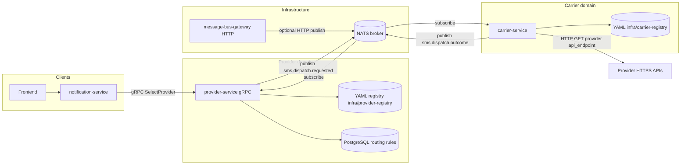
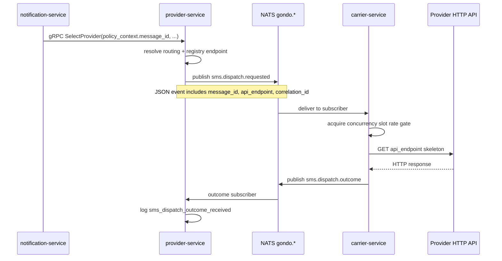

# Go & Do - Membership Registration

## Team Members

- Hien Huynh (Team Lead / Kaluza Pod 4)
- Thien Nguyen (Developer / Kaluza Pod 3)

## Architecture

NX monorepo with Python/FastAPI backend microservices, a React frontend, and optional **NATS** messaging for asynchronous SMS dispatch.

| App | Type | HTTP | gRPC | Description |
|-----|------|------|------|-------------|
| `notification-service` | Python / FastAPI | 8001 | — | SMS lifecycle orchestration |
| `provider-service` | Python / FastAPI | 8002 | 50051 | Provider registry, routing rules, YAML-backed registry metadata, CQRS publish/consume via message bus |
| `charging-service` | Python / FastAPI | 8003 | 50052 | Cost estimation and recording |
| `carrier-service` | Python / FastAPI | 8004 | — | Carrier bounded context: dispatch from the bus, outbound HTTP probe, and **HTTP carrier-registry** (`GET /registry/carriers`) backed by `infra/carrier-registry/` |
| `message-bus-gateway` | Python / FastAPI | 8010 | — | Optional HTTP → NATS publish proxy (sidecar-style tooling) |
| `nats` | broker | 4222 | — | Default message broker behind `py_core.bus` |
| `frontend` | React / Vite | 4200 | — | Web UI |

### Documentation map (per-service READMEs)

| Service | Doc |
|---------|-----|
| Provider (gRPC + registry + CQRS) | [apps/provider-service/README.md](apps/provider-service/README.md) |
| Carrier (dispatch execution) | [apps/carrier-service/README.md](apps/carrier-service/README.md) |
| Message bus gateway | [apps/message-bus-gateway/README.md](apps/message-bus-gateway/README.md) |
| Notification (HTTP API) | [apps/notification-service/README.md](apps/notification-service/README.md) |

Shared topic names: `infra/message-bus/topics.yaml`. NATS subjects: `gondo.<logical-topic>` (see `py_core.bus.topics.topic_to_subject`).

**Provider YAML registry** (`infra/provider-registry/`): **partitioned by country** — `index.yaml` lists `countries/<ISO>/index.yaml`; each country lists provider fragments. The same `provider_id` in multiple countries is **merged** at load time (e.g. Twilio VN + SG). Legacy flat `provider_files` in the root index is still supported for tests. **Carrier (MNO) registry** is a separate tree, **`infra/carrier-registry/`**, loaded only by **carrier-service** (DDD: provider vs carrier bounded contexts).

| Registry | Path | Served by |
|----------|------|-----------|
| Provider (SMS aggregators, coverage, `credentials_ref`) | `infra/provider-registry/` | provider-service (gRPC `GetProviderRegistry` + in-process routing) |
| Carrier (MNO routing hints, `carrier_credentials_ref`) | `infra/carrier-registry/` | carrier-service (`GET /registry/carriers`) |

## Prerequisites

- Node.js 20 (pinned via `.nvmrc` — run `nvm use` to activate)
- Python 3.13+
- Yarn 1.22+
- (optional) `grpcurl` / `grpcui` for exploring gRPC contracts — `brew install grpcurl grpcui`

## How to Run

### 1. Install JS dependencies

```bash
nvm use        # uses .nvmrc to select Node 20
yarn install
```

### 2. Set up Python virtual environment

```bash
python3 -m venv .venv
source .venv/bin/activate
pip install -r apps/notification-service/requirements.txt
```

All three Python services share the same dependency set.

### 3. Start all services (recommended)

```bash
yarn start
# or directly:
bash scripts/start-all.sh
```

This starts charging → provider → notification in the correct order with health checks. Press Ctrl+C to stop all.

### Start services individually

```bash
yarn nx run charging-service:serve      # port 8003 + gRPC 50052
yarn nx run provider-service:serve      # port 8002 + gRPC 50051
yarn nx run notification-service:serve  # port 8001 (main entry)
```

To stop all services:

```bash
yarn stop
```

### Frontend (port 4200)

```bash
yarn nx run frontend:serve
```

### 4. Run tests

```bash
# All projects
yarn nx run-many -t test

# Individual
yarn nx run notification-service:test
yarn nx run frontend:test
```

### 5. Lint

```bash
# All projects
yarn nx run-many -t lint

# Individual
yarn nx run notification-service:lint
yarn nx run frontend:lint
```

### 6. Build

```bash
# All projects
yarn nx run-many -t build

# Individual
yarn nx run frontend:build
```

### 7. Generate OpenAPI contract

```bash
yarn nx run notification-service:generate-openapi
# Outputs: apps/notification-service/openapi.json
```

### 8. Useful NX commands

```bash
yarn nx show projects          # list all projects
yarn nx graph                  # visualize project graph
yarn nx affected -t test,lint  # run only affected targets
```

## Docker (E2E)

Run all backend services in containers:

```bash
yarn docker:up       # build and start all services
yarn docker:logs     # tail logs from all containers
yarn docker:down     # stop and remove containers
```

Or from this folder:

```bash
docker compose up --build
```

**Troubleshooting:** If `docker compose` fails with **`'compose' is not a docker command`** or **`unknown shorthand flag: 'd'`**, the Compose V2 plugin is not installed for your `docker` CLI. Use **`docker-compose`** (hyphen) instead — e.g. **`yarn docker:up`**, which runs `docker-compose up --build -d`. With **Colima**, run **`colima start`** first; there is no `colima docker compose` command.

**Integration test (SMS happy path):** with the stack healthy on localhost, from `gondo/` run `yarn test:integration` (sets `RUN_INTEGRATION_TESTS=1` and runs `tests/integration/` against **notification-service**). Requires **Postgres migrated**, **NATS**, **provider-service**, **carrier-service**, and **notification-service**. Optional: `NOTIFICATION_SERVICE_URL` if not on `http://127.0.0.1:8001`.

Compose also starts **NATS** (`4222`), **WireMock** (`18080` on the host → `8080` in the mesh) for the carrier outbound HTTP probe, **carrier-service** (`8004`), and **message-bus-gateway** (`8010`) when using `docker-compose.yml` in `gondo/`. **provider-service** sets **`CARRIER_HTTP_PROBE_URL=http://wiremock:8080/carrier/sms`** so dispatch events use the stub; add or edit JSON under **`infra/wiremock/mappings/`** to change the mock. Set `NATS_URL=nats://nats:4222` for services that use `libs/py-core` message bus (default in Compose).

**Extra compose files** (overlays, Postgres-only, NATS-only, messaging stack) live under [`infra/`](infra/) — see [`infra/README.md`](infra/README.md) for the full list and example `docker compose -f …` commands.

### Mock AWS credentials ([Floci](https://floci.io/))

[Floci](https://floci.io/) is a fast, MIT-licensed local AWS emulator (Secrets Manager, S3, etc.) on **port 4566**, compatible with the AWS SDK when you set `AWS_ENDPOINT_URL` (similar ergonomics to LocalStack for app code).

- **Default in this repo:** `CREDENTIALS_BACKEND=mock` with JSON at `infra/credentials/mock/secrets.json` (no cloud).
- **Optional — exercise AWS Secrets Manager locally:** start Floci with the Compose profile, create secrets with the AWS CLI, then point **provider-service** at the emulator:

```bash
docker compose --profile mock-cloud up -d floci
# Example: create a secret Floci can serve (SDK uses same call as real AWS)
aws --endpoint-url http://localhost:4566 secretsmanager create-secret \
  --name provider/prv_01 --secret-string '{"api_key":"local-demo"}' \
  --region us-east-1
```

Then set `CREDENTIALS_BACKEND=aws_secrets_manager`, `AWS_ENDPOINT_URL=http://localhost:4566` (or `http://floci:4566` from other containers on the Compose network), and dummy keys `AWS_ACCESS_KEY_ID` / `AWS_SECRET_ACCESS_KEY` as required by the SDK.

Once running, core HTTP endpoints:

- Notification: http://localhost:8001/docs
- Provider: http://localhost:8002/docs
- Charging: http://localhost:8003/docs
- Carrier: http://localhost:8004/docs
- Message bus gateway: http://localhost:8010/docs

Test E2E connectivity:

```bash
curl http://localhost:8001/health
```

## Message bus and carrier dispatch (integration)

Asynchronous SMS dispatch uses a **broker-agnostic** `MessageBus` in `libs/py-core` (default: **NATS**). **provider-service** publishes `sms.dispatch.requested` after `SelectProvider` when `policy_context.message_id` is set; **carrier-service** consumes the event, performs a bounded-concurrency HTTP call to the registry `api_endpoint`, and publishes `sms.dispatch.outcome`; **provider-service** subscribes to outcomes for logging. This keeps heavy or rate-limited HTTP work off the gRPC hot path.

### System integration (diagram)



### Sequence: SMS dispatch via bus



### Libraries

- **`libs/py-core`**: `MessageBus` protocol, NATS adapter, `publish_json`, shared FastAPI/gRPC helpers.
- **`libs/grpc-contracts`**: Protobuf + generated Python stubs.

## gRPC Contracts

Internal service-to-service communication uses gRPC. Proto definitions live in `libs/grpc-contracts/protos/`.

| Proto | Service | RPCs | Consumers |
|-------|---------|------|-----------|
| `provider.proto` | `ProviderService` (:50051) | `ResolveRouting`, `SelectProvider`, `GetProviderRegistry` | notification-service |
| `charging.proto` | `ChargingService` (:50052) | `EstimateCost`, `EstimateCostBatch`, `RecordActualCost` | — |

### Reviewing contracts

**Read the proto files directly:**

```bash
cat libs/grpc-contracts/protos/provider.proto
cat libs/grpc-contracts/protos/charging.proto
```

### gRPC Reflection (Swagger-like UI for gRPC)

All gRPC servers enable [Server Reflection](https://grpc.io/docs/guides/reflection/) via the shared `libs/grpc-contracts/reflection.py` plugin. This lets tools like `grpcui` and `grpcurl` discover services at runtime — no proto files needed on the client side.

**grpcui — interactive web UI (like Swagger for gRPC):**

```bash
brew install grpcui

yarn start   # services must be running

grpcui -plaintext localhost:50051   # Provider Service
grpcui -plaintext localhost:50052   # Charging Service
```

This opens a browser with forms for every RPC, input fields for each message field, and live responses.

**grpcurl — CLI client (like curl for gRPC):**

```bash
brew install grpcurl

# List services
grpcurl -plaintext localhost:50051 list
grpcurl -plaintext localhost:50052 list

# Describe a service
grpcurl -plaintext localhost:50051 describe gondo.provider.ProviderService
grpcurl -plaintext localhost:50052 describe gondo.charging.ChargingService

# SelectProvider (provider-service :50051)
grpcurl -plaintext -d '{
  "country_code": "VN",
  "carrier": "VIETTEL",
  "as_of": "2026-04-11T00:00:00Z",
  "policy_context": {"policy": "lowest_cost_healthy", "message_id": "msg_001"}
}' localhost:50051 gondo.provider.ProviderService/SelectProvider

# EstimateCost (charging-service :50052)
grpcurl -plaintext -d '{
  "message_id": "msg_001",
  "provider_id": "prv_02",
  "country_code": "VN",
  "carrier": "VIETTEL",
  "as_of": "2026-04-11T00:00:00Z"
}' localhost:50052 gondo.charging.ChargingService/EstimateCost
```

**Adding reflection to a new gRPC service:**

```python
from reflection import enable_reflection
from generated import my_pb2

server = aio.server()
add_MyServiceServicer_to_server(MyServicer(), server)
enable_reflection(server, [my_pb2.DESCRIPTOR])  # one line
```

### Regenerating stubs

After editing any `.proto` file:

```bash
yarn nx run grpc-contracts:generate
```

Generated Python stubs are written to `libs/grpc-contracts/generated/`.

## Design Decisions

- **NX monorepo** for unified task orchestration across Python and JS projects
- **FastAPI + OpenAPI** for public HTTP contracts; gRPC planned for internal service calls
- **Vite** as the React bundler for fast dev experience
- **`nx:run-commands`** executor for Python services (no native NX Python plugin)
- **Message bus (`py_core.bus`)** with NATS as the default transport: logical topics in `infra/message-bus/topics.yaml`, subject prefix `gondo.*`; carrier dispatch is asynchronous to avoid blocking gRPC and to centralize outbound rate control

## Challenges Faced

[What was hard? How did you overcome it?]

## What We Learned

[New skills, technologies, or insights]

## With More Time, We Would...

[Nice-to-haves you didn't implement]

## AI Tools Used (if any)

[Which tools? How did they help?]
