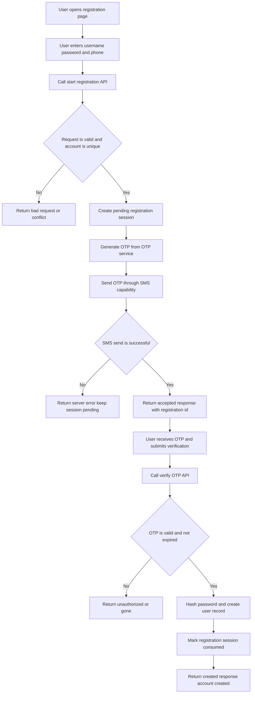

# Specs-Kit: Account Registration User Journey

## 1. Goal
Define the end-to-end user journey for account registration with SMS OTP verification, from registration start to successful account creation.

## 2. Scope
- In scope:
  - User submits registration data.
  - System sends OTP via SMS.
  - User verifies OTP.
  - Account creation is completed successfully.
- Out of scope:
  - OTP generation algorithm internals.
  - Real provider integration details (simulation is allowed).

## 3. Actors
- End User: starts registration and enters OTP.
- Customer Domain API: handles registration and OTP verification.
- SMS Capability: routes and sends OTP SMS.
- SMS Provider Adapter: simulates provider behavior and callbacks.

## 4. Preconditions
- Username is not already used.
- Phone number is not already used.
- Phone number format is valid for target country.
- OTP is available from OTP service (existing capability).

## 5. Main User Journey Flow

### Journey ID
`UJ-REG-OTP-001`

### Success Path
1. User opens registration form.
2. User inputs `username`, `password`, and `phone_number`.
3. User clicks `Register`.
4. System validates request payload.
5. System checks uniqueness of `username` and `phone_number`.
6. System creates a pending registration session.
7. System requests OTP from OTP service.
8. System sends OTP SMS through SMS capability.
9. User receives OTP on phone.
10. User inputs OTP and submits verification.
11. System verifies OTP against pending registration session.
12. System hashes password and persists new user account.
13. System marks registration as completed.
14. User sees success message: `Account created successfully`.

### Mermaid Flow Diagram


### Postconditions
- User account exists with unique `username` and `phone_number`.
- Password is stored as hash only.
- Registration session is closed/consumed after successful verification.
- OTP cannot be reused.

## 6. Alternative and Failure Flows

### AF-01 Invalid Payload
- If required fields are missing, return `400 Bad Request`.

### AF-02 Duplicate Username
- If username already exists, return `409 Conflict`.

### AF-03 Duplicate Phone Number
- If phone number already exists, return `409 Conflict`.

### AF-04 SMS Send Failure
- If SMS provider send fails, return `500 Internal Server Error` for registration start.
- Registration session remains pending and can be retried based on policy.

### AF-05 OTP Incorrect
- If OTP is wrong, return `401 Unauthorized` with `Invalid OTP`.

### AF-06 OTP Expired
- If OTP is expired, return `410 Gone` with `OTP expired`.

### AF-07 OTP Retry Limit Reached
- If max attempts exceeded (`10` SMS per hour per phone number), lock the current pending session and require the user to start a new registration session.

### AF-08 Intensive New-Session Attempts (Abuse Prevention)
- To prevent abusive repeated restarts, enforce rate limits across identity signals:
  - Max `10` SMS per hour per phone number.
  - Max `5` registration starts per hour per IP address.
  - Max `5` registration starts per hour per device fingerprint (if available).
- Apply progressive cooldown after threshold breaches (for example: 5 min, 15 min, 60 min).
- Require CAPTCHA or equivalent challenge after repeated failures.
- Log and monitor suspicious patterns for security review.

## 7. API-Level Journey Contracts

### 7.1 Start Registration
`POST /api/register/start`

Request:
```json
{
  "username": "alice01",
  "password": "S3cret!",
  "phone_number": "09171234567",
  "country": "PH"
}
```

Success response (`202 Accepted`):
```json
{
  "message": "OTP sent to phone number",
  "registration_id": "reg_12345",
  "otp_channel": "sms"
}
```

### 7.2 Verify OTP and Complete Registration
`POST /api/register/verify-otp`

Request:
```json
{
  "registration_id": "reg_12345",
  "otp_code": "123456"
}
```

Success response (`201 Created`):
```json
{
  "message": "Account created successfully",
  "user": {
    "id": 1001,
    "username": "alice01",
    "phone_number": "09171234567"
  }
}
```

## 8. Acceptance Criteria
- Registration start sends OTP SMS to provided phone number.
- OTP verification is required before account becomes active.
- Correct OTP creates account and returns success response.
- Incorrect/expired OTP does not create account.
- Duplicate username/phone validations are enforced.

## 9. Automation Test Journey (High-Level)
- Test Name: `Registration_With_SMS_OTP_Success`
- Given:
  - New username and phone number.
  - OTP service returns a valid OTP.
- When:
  - Call `POST /api/register/start`.
  - Fetch OTP from test SMS channel or mock store.
  - Call `POST /api/register/verify-otp` with fetched OTP.
- Then:
  - Verify `201 Created`.
  - Verify response message is success.
  - Verify user exists in repository.

## 10. Concrete Test Matrix

| ID | Scenario | Preconditions | Steps | Expected Result |
| --- | --- | --- | --- | --- |
| REG-001 | Happy path registration with valid OTP | New username and phone, OTP service and SMS mock available | 1) `POST /api/register/start` 2) Read OTP from test channel 3) `POST /api/register/verify-otp` with valid code | `202` then `201`; account created; session consumed; OTP cannot be reused |
| REG-002 | Missing required fields | None | `POST /api/register/start` with missing `username` or `password` or `phone_number` | `400 Bad Request`; no OTP sent; no session created |
| REG-003 | Duplicate username | Existing user with same username | `POST /api/register/start` using existing username + new phone | `409 Conflict`; no OTP sent |
| REG-004 | Duplicate phone number | Existing user with same phone | `POST /api/register/start` using new username + existing phone | `409 Conflict`; no OTP sent |
| REG-005 | SMS provider transient failure then success | Mock provider fails first attempt, alternate path available | 1) Start registration 2) System retries/fails over 3) User verifies OTP | Registration still proceeds; final verification succeeds; logs show retry/failover |
| REG-006 | SMS send hard failure | All configured providers fail | `POST /api/register/start` | `500 Internal Server Error`; session state remains pending or failed per policy; no account created |
| REG-007 | Incorrect OTP | Pending session exists | 1) Start registration 2) Verify with wrong OTP | `401 Unauthorized`; account not created; attempt counter increments |
| REG-008 | Expired OTP | Pending session with expired OTP | 1) Start registration 2) Verify after OTP TTL | `410 Gone`; account not created |
| REG-009 | Reuse OTP after success | Account already created from same session | Submit same OTP again with same `registration_id` | Request rejected (`401/409`); no duplicate account |
| REG-010 | OTP send limit per phone reached | Same phone has already reached 10 SMS in 1 hour | Repeatedly trigger start flow for same phone until threshold exceeded | Limit enforced at 10; subsequent request blocked (`429` recommended); session locked/new session blocked by cooldown |
| REG-011 | Intensive restart by IP | Registration start attempts from same IP exceed policy threshold | Trigger `POST /api/register/start` > 5 times/hour from same IP | Further starts throttled (`429`); cooldown applied; optional CAPTCHA challenge required |
| REG-012 | Intensive restart by device fingerprint | Device fingerprint available and threshold exceeded | Trigger start flow > 5 times/hour from same device | Further starts throttled (`429`); cooldown applied |
| REG-013 | Session consumption behavior | Successful verification completed | Try `POST /api/register/verify-otp` again for consumed `registration_id` | Rejected; session remains closed; no side effects |
| REG-014 | Data integrity after success | Success flow executed | Verify persisted user record and security fields | User exists with unique username and phone; password stored as hash only |
| REG-015 | Audit and monitoring event validation | Logging/metrics enabled | Run failed and successful scenarios | Logs contain provider, status transitions, and anti-abuse events for investigation |

### Test Data Notes
- Use unique `username` and `phone_number` per test run unless explicitly testing duplicates.
- Mock OTP source must support deterministic retrieval for automation.
- Use isolated rate-limit buckets for repeatable CI tests (test tenant or reset hooks).

### Priority
- P0: `REG-001`, `REG-003`, `REG-004`, `REG-007`, `REG-008`, `REG-010`
- P1: `REG-005`, `REG-006`, `REG-011`, `REG-013`, `REG-014`
- P2: `REG-009`, `REG-012`, `REG-015`

## Related specs-kit documents

- [SPECS_KIT_TESTCASES_MATRIX.md](./SPECS_KIT_TESTCASES_MATRIX.md) — full testcase matrix (registration, SMS core, FSM).
- [SPECS_KIT_SMS_INVALID_TRANSITIONS_AND_RECOVERY.md](./SPECS_KIT_SMS_INVALID_TRANSITIONS_AND_RECOVERY.md) — summary of unexpected invalid SMS status transitions and recovery methods.
