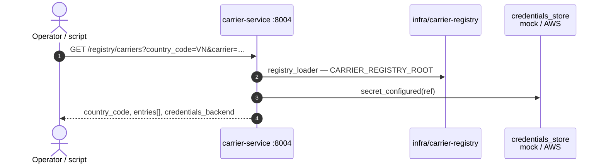

# Carrier registry HTTP (bounded context)

- **Not** **`infra/provider-registry`** — carrier MNO config lives in **`infra/carrier-registry/`**.
- **Loader / env diagram:** **[registry-config-loading.md](registry-config-loading.md)**.

**carrier-service** exposes read-only metadata at **`GET /registry/carriers`** (no raw secrets).

Response shape (conceptual): **`entries[]`** with **`carrier_code`**, **`routing_hints`**, **`carrier_credentials_ref`**, **`carrier_credentials_configured`**.

## Code references

- `apps/carrier-service/registry_routes.py`
- `apps/carrier-service/registry_loader.py`
- `libs/py-core/py_core/credentials_store.py`
