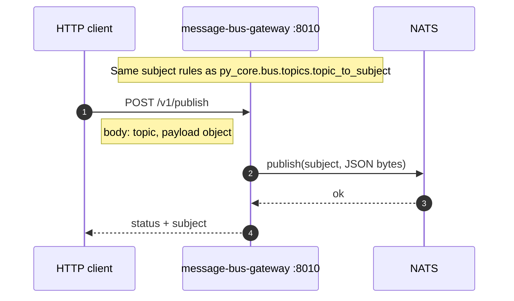

# Message bus gateway (optional)

Production services use **`py_core.bus.MessageBus`** (NATS) in-process. The gateway lets **scripts or tools** publish without **`nats-py`**: **`POST /v1/publish`** with a **logical topic** and **JSON payload** — subject becomes **`gondo.<topic>`**.

## Compared to in-process bus

| Path | Use case |
|------|----------|
| **Gateway** | curl / Postman / CI publishing test events |
| **py_core.bus** in apps | provider, carrier, notification subscribers |

## Code references

- `apps/message-bus-gateway/main.py` — `/v1/publish`, `/health`
- `libs/py-core/py_core/bus/topics.py` — `topic_to_subject`
