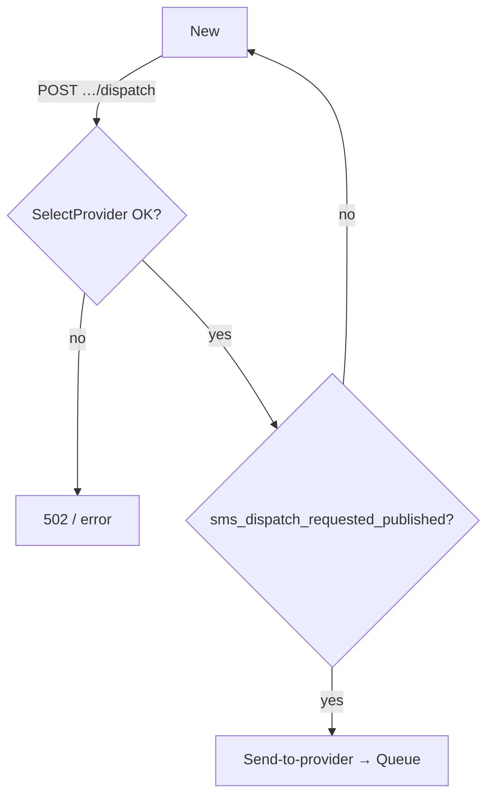
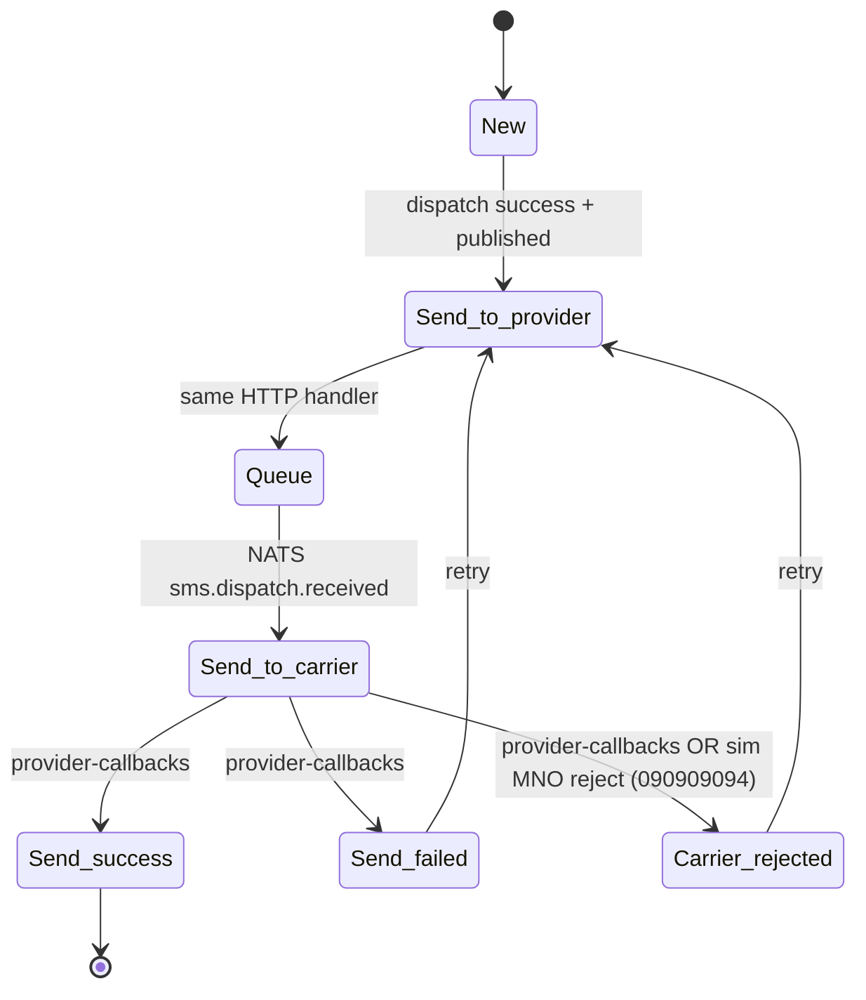

# Notification lifecycle (aggregate)

String states and **`VALID_TRANSITIONS`** live in **`apps/notification-service/models.py`**.

- **Queue → Send-to-carrier** is **async** via NATS **`sms.dispatch.received`** (`cqrs/carrier_dispatch_received.py`).
- **New → Queue** on dispatch requires **gRPC `sms_dispatch_requested_published`**; otherwise **HTTP 503** and state stays **New** (see dispatch sequence).

## Dispatch gating (before Queue)

## Aggregate states (valid transitions)

Challenge brief also lists **`Queue → Carrier-rejected`** without **Send-to-carrier** (shorthand). This repo treats **Carrier-rejected** per definition as MNO rejection after provider acceptance: **`Queue → Send-to-carrier`** on **`sms.dispatch.received`**, then **`Send-to-carrier → Carrier-rejected`** when the simulated MNO refuses the MT (see **`carrier_auto_reject`**), or **`POST /provider-callbacks`** with **`new_state`** **`Carrier-rejected`** from **Send-to-carrier**.

Code uses hyphenated names: **`Send-to-provider`**, **`Queue`**, **`Send-to-carrier`**, **`Send-success`**, **`Send-failed`**, **`Carrier-rejected`**.

## Code references

| Area | Path |
|------|------|
| Transitions table | `apps/notification-service/models.py` |
| Dispatch / retry + publish guard | `apps/notification-service/main.py` |
| Async Queue → Send-to-carrier | `apps/notification-service/cqrs/carrier_dispatch_received.py`, `cqrs/dispatch_received_subscriber.py` |
| Provider callbacks | `POST /provider-callbacks` in `main.py` |
