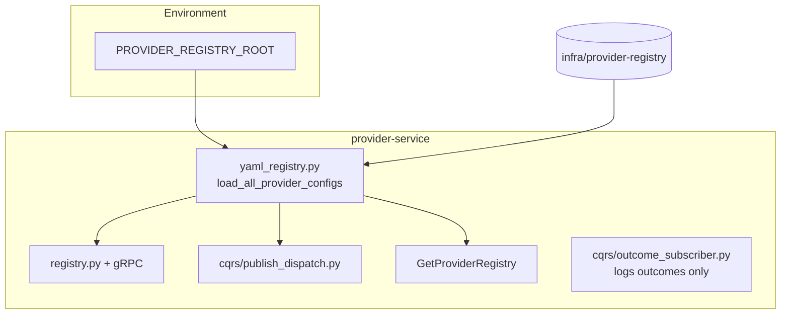
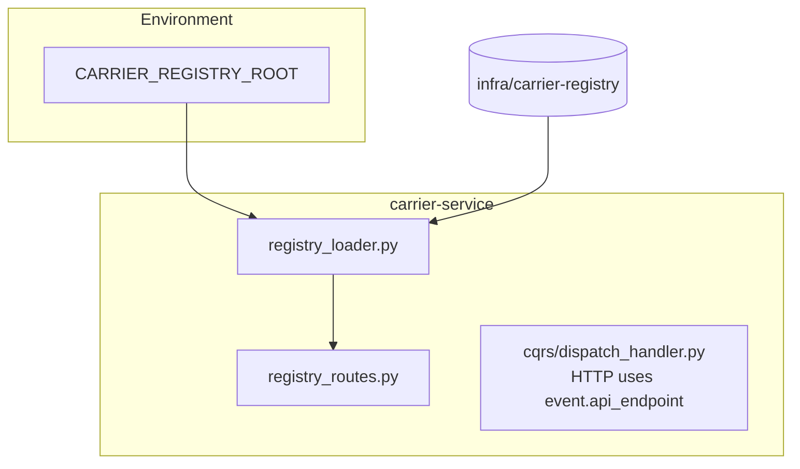
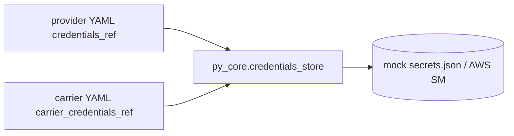

# Registry config: provider-service vs carrier-service

On-disk YAML under **`coding-challenge-2/gondo/infra/`**. Override roots with **`PROVIDER_REGISTRY_ROOT`** / **`CARRIER_REGISTRY_ROOT`** (Docker: **`/app/infra/...`**).

**Credentials:** YAML holds **refs** only; **`libs/py-core/py_core/credentials_store.py`** resolves **mock JSON** or **AWS Secrets Manager** — never return raw secrets on APIs.

## Provider — `infra/provider-registry/`

Routing, merged **`provider_id`** across countries, **`api_endpoint`** for **`sms.dispatch.requested`**, **`credentials_ref`** for gRPC registry metadata.

| Consumer | Reads |
|----------|--------|
| Routing / **SelectProvider** | PostgreSQL rules + **`yaml_registry`** merged rows |
| **`sms.dispatch.requested` JSON** | **`api_endpoint`** from selected provider row (`publish_dispatch`) |
| **GetProviderRegistry** | Filtered configs + **`credentials_configured`** |

---

## Carrier — `infra/carrier-registry/`

**Only carrier-service** loads this tree (DDD). Used for **`GET /registry/carriers`** and **`secret_configured`** on responses.

**Outbound dispatch HTTP** uses **`api_endpoint`** from the **NATS event payload** (set when provider published **`sms.dispatch.requested`**), not a second registry lookup in **`dispatch_handler`**.

---

## Shared credentials

| Env (typical) | Role |
|---------------|------|
| `CREDENTIALS_BACKEND` | `mock` or `aws_secrets_manager` |
| `MOCK_CREDENTIALS_PATH` | Path to JSON for local dev |

## Code references

| Area | Path |
|------|------|
| Provider load / merge | `apps/provider-service/yaml_registry.py` |
| Publish payload | `apps/provider-service/cqrs/publish_dispatch.py` |
| Carrier load | `apps/carrier-service/registry_loader.py` |
| Carrier HTTP | `apps/carrier-service/registry_routes.py` |
| Credentials | `libs/py-core/py_core/credentials_store.py` |
| Compose env | `coding-challenge-2/gondo/docker-compose.yml` |
