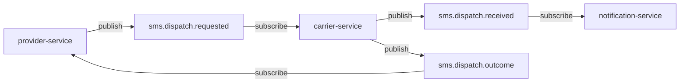

# SMS dispatch — logical topics (NATS)

- **Subject rule:** each logical topic is published on **`gondo.<topic>`** (e.g. `gondo.sms.dispatch.requested`). See **`topic_to_subject`** in `libs/py-core/py_core/bus/topics.py`.
- **Canonical list:** `coding-challenge-2/gondo/infra/message-bus/topics.yaml`.

## Topic table

| Logical topic | Published by | Consumed by | Purpose |
|---------------|--------------|-------------|---------|
| `sms.dispatch.requested` | provider-service | carrier-service | Work item: **`api_endpoint`** + ids for outbound HTTP |
| `sms.dispatch.received` | carrier-service | notification-service | Carrier took job → **Queue → Send-to-carrier** |
| `sms.dispatch.outcome` | carrier-service | provider-service | Send attempt result (logged) |

## Optional: HTTP publish via gateway

Tools may use **message-bus-gateway** **`POST /v1/publish`** instead of embedding NATS — see **[message-bus-gateway-optional.md](message-bus-gateway-optional.md)**.

## Code references

- `infra/message-bus/topics.yaml`
- `libs/py-core/py_core/bus/topics.py` (`SMS_DISPATCH_REQUESTED`, `SMS_DISPATCH_RECEIVED`, `SMS_DISPATCH_OUTCOME`)
